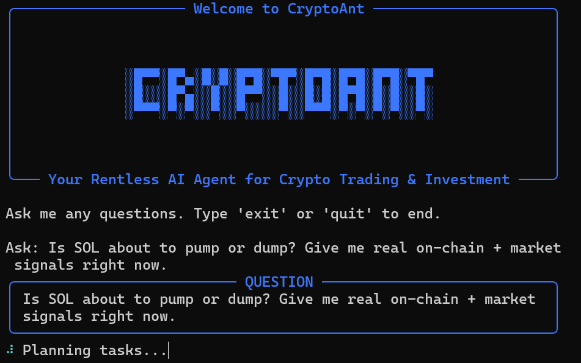

# CryptoAnt 

[](https://www.python.org/downloads/)
[](https://opensource.org/licenses/MIT)


**CryptoAnt** (a.k.a. **Ant**) is an open-source, fully autonomous AI agent designed exclusively for cryptocurrency research, on-chain analytics, DeFi intelligence, and trading edge discovery.

Ask any crypto question — token economics, liquidity flows, whale movements, funding rates, ETF inflows, etc. — and Ant will break it down, call the right tools via the **Model Context Protocol (MCP)**, verify data step-by-step, and stream a precise, data-rich answer directly in your terminal.

No dashboards. No manual API calls. Just ask.



### Powered by the Model Context Protocol (MCP)

CryptoAnt is 100% MCP-native. Connect any public or private MCP server (Raydium/Jupiter, Coinglass, DeFiLlama, Dune dashboards, private whale trackers, etc.) and Ant instantly gains new superpowers — no code changes required.

### Quick Start

```bash
git clone https://github.com/kukapay/cryptoant.git
cd cryptoant

uv sync                                    # lightning-fast install

cp env.example .env
cp mcp.json.example mcp.json

# Edit .env → add your OpenAI (or compatible) key
# Edit mcp.json → add the MCP servers you want

uv run ant                                # start asking
```

### Configuration

#### `.env` — LLM (any OpenAI-compatible provider)

```env
OPENAI_API_KEY=sk-...
OPENAI_BASE_URL=https://api.openai.com/v1      # change for Groq, Anthropic, DeepSeek, etc.
OPENAI_MODEL_ID=gpt-4o                         # or claude-3-5-sonnet, llama-3.1-70b, etc.
```

#### `mcp.json` — Unlimited Crypto Data Sources

```json
{
  "mcpServers": {
    "raydium-jupiter": { 
      "url": "https://mcp.raydium.io/v1", 
      "transport": "streamable_http" 
    },
    "coinglass": { 
      "url": "https://mcp.coinglass.com/v1", 
      "transport": "streamable_http" 
    },
    "my-whale-tracker":{ 
      "command": "uv", 
      "args": ["--directory", "/home/me/whale-mcp", "run", "server.py"], 
      "transport": "stdio" 
    }
  }
}
```

### Live Example Session

```text
Ask: Is SOL about to pump or dump right now? Show real on-chain + market signals.

Planning tasks... done
Executing birdeye_token_overview...
Executing jupiter_strict_swaps...
Executing raydium_pool_depth...
Executing coinglass_funding_rates...
Executing solana_whale_transfers... (last 6h)

SOLANA (SOL) — Real-time Edge Report (2025-04-05)

Current price: $178.4   │   1h +4.7%   │   24h +11.3%

Liquidity & Order Flow
• Raydium SOL/USDC pool depth: $184 M
  → Last 30 min buy pressure: +68 %
• Jupiter volume last hour: $2.71 B (highest since Jan)
• 73 % of recent swap volume is buys

Funding
• Avg perp funding rate: +41.7 % annualized (97th percentile)

Whales (last 6h)
• 4 × >100k SOL moved from exchanges → fresh wallets
• Largest: 312k SOL ($55.6 M) → brand-new wallet 11 min ago

Conclusion
Extreme bullish confluence. High probability of continuation toward $190–$200 in the next 12 h.
Risk of long liquidation cascade if funding stays >40 % another 8 h.

Position accordingly.
```

### Credits & Special Thanks

CryptoAnt is a **proud fork** of the excellent stock-focused AI agent [**Dexter**](https://github.com/virattt/dexter) by [@virattt](https://github.com/virattt).  Huge thanks to Virat for open-sourcing such high-quality, forward-thinking code — CryptoAnt literally started life as a crypto-specialized version of Dexter.

### License

Released under the **MIT License** — feel free to use, modify, and redistribute (including commercially).  
See the [LICENSE](LICENSE) file for the full text.
